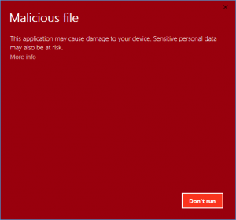

# WARNING

###  UWAGA — URUCHAMIASZ TEN PROGRAM NA WŁASNĄ ODPOWIEDZIALNOŚĆ 

**Program może powodować nietypowe zachowanie systemu Windows.**
Jeżeli nie wiesz, co robisz — **nie uruchamiaj go na swoim głównym systemie.**

---

##  Start

Przed rozpoczęciem upewnij się, że:

*  **Antywirus jest wyłączony**
*  Używasz **Windows 10 lub Windows 11**
*  Najlepiej uruchomić `.exe` **jako Administrator** *(czasami nie jest to wymagane)*
*  Zalecane jest uruchomienie programu na **maszynie wirtualnej (VM)**

>  **Uruchamiasz program na własne ryzyko.**

---

##  O wirusie

> **Informacja:** Projekt jest programem typu *Windows Party Mode* i został stworzony w celach rozrywkowych/testowych.

1.  Program **nie posiada stealera**.
2.  Program posiada mechanizm **Anti Alt+F4**.
3.  Jego działanie jest zbliżone do różnych programów typu **Windows Party Mode**.
4.  Program może powodować nietypowe zachowanie systemu, dlatego **zalecane jest używanie VM**.
5.  **Nie ponoszę odpowiedzialności za jakiekolwiek szkody** wynikające z uruchomienia programu.

---

##  Wymagania

| Wymaganie      | Informacja               |
| -------------- | ------------------------ |
|  System      | Windows 10 / Windows 11  |
|  Uprawnienia | Administrator — zalecane |
|  VM          | Zalecane                 |
|  Antywirus  | Może wykrywać program    |

---

##  Source Code

###  Tymczasowo niedostępny

Pobieranie **Source Code** jest chwilowo niedostępne.

> Source Code może zostać udostępniony w przyszłości.

---

##  Rozwiązywanie problemów

###  Problem: Brak wymaganego API / sterownika

**Rozwiązanie:**
Znajdź **oficjalny installer** sterownika/API, którego program wymaga do działania.

---

###  Problem: Antywirus wykrył potencjalnie niechcianą aplikację

**Rozwiązanie:**
Program może być wykrywany przez system antywirusowy ze względu na sposób jego działania.

Jeżeli **świadomie pobrałeś program z tego repozytorium i ufasz jego źródłu**, możesz przeanalizować alert i zdecydować, czy chcesz go uruchomić.

>  **Nie wyłączaj zabezpieczeń systemu bez upewnienia się, co dokładnie uruchamiasz.**

---

##  Dalsza lektura

* 📖 [Powiązana dokumentacja](niedostępne)
* 📑 [Dokumentacja referencyjna](niedostępne)
* 📘 [Przewodnik](niedostępne)

---

###  USE AT YOUR OWN RISK 

**Made for testing / entertainment purposes.**

